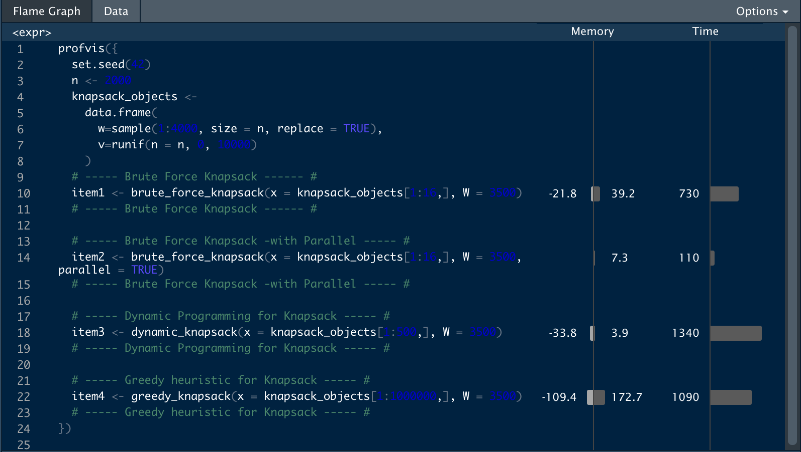

---
title: "Knapsack Problem"
author: "Chathuranga Silva, Mohammed Bakheet, and Nikodimos Gezahegn"
date: "11th October 2019"
output: rmarkdown::html_vignette
vignette: >
  %\VignetteIndexEntry{lab_report_knapsack}
  %\VignetteEngine{knitr::rmarkdown}
  %\VignetteEncoding{UTF-8}
---

```{r, include = FALSE}
knitr::opts_chunk$set(
  collapse = TRUE,
  comment = "#>"
)
```

```{r setup}
library(lab6)
library(profvis)
library(parallel)
```

# Profiling

Profiling could be manually run on profile_provis.R file



# LAB 06 Answers

**Question: 1.1.2**
How much time does it takes to run the algorithm for n = 16 objects?

```c

library(profvis)

profvis({
  set.seed(42)
  n <- 2000
  knapsack_objects <-
    data.frame(
      w=sample(1:4000, size = n, replace = TRUE),
      v=runif(n = n, 0, 10000)
    )
  # ----- Brute Force Knapsack ------ #
  item1 <- brute_force_knapsack(x = knapsack_objects[1:16,], W = 3500)
  # ----- Brute Force Knapsack ------ #
})
```

**Answer:**
By using profvis, for n = 16 , time = 730ms (0.73 seconds)

**Question: 1.1.3**
How much time does it takes to run the algorithm for n = 500 objects?

```c

library(profvis)

profvis({
  set.seed(42)
  n <- 2000
  knapsack_objects <-
    data.frame(
      w=sample(1:4000, size = n, replace = TRUE),
      v=runif(n = n, 0, 10000)
    )
  # ----- Dynamic Programming for Knapsack ----- #
  item3 <- dynamic_knapsack(x = knapsack_objects[1:500,], W = 3500)
  # ----- Dynamic Programming for Knapsack ----- #
})
```
**Answer:**
By using profvis, for n = 500, time = 1340ms (1.34 seconds)

**Question: 1.1.4**
How much time does it takes to run the algorithm for n = 1000000 objects?

```c

library(profvis)

profvis({
  set.seed(42)
  n <- 2000
  knapsack_objects <-
    data.frame(
      w=sample(1:4000, size = n, replace = TRUE),
      v=runif(n = n, 0, 10000)
    )
  # ----- Greedy heuristic for Knapsack ----- #
  item4 <- greedy_knapsack(x = knapsack_objects[1:1000000,], W = 3500)
  # ----- Greedy heuristic for Knapsack ----- #
})
```

**Answer:**
By using profvis, for n = 1000000, time = 1090ms (1.09 seconds)

**Question: 1.1.6**
What performance gain could you get by trying to improving your code?

**Answer:**
lineprof is not working properly on mac machines. Therefore 'profvis' package has been implemented.

By using 'profvis' we found that 'combn' function takes more time. Therefore we implemented parallel programing for 'combn'.

**Question: 1.1.8**
What performance gain could you get by parallelizing brute force search?

```c

library(profvis)

profvis({
  set.seed(42)
  n <- 2000
  knapsack_objects <-
    data.frame(
      w=sample(1:4000, size = n, replace = TRUE),
      v=runif(n = n, 0, 10000)
    )
  
  # ----- Brute Force Knapsack -with Parallel ----- #
  item2 <- brute_force_knapsack(x = knapsack_objects[1:16,], W = 3500, parallel = TRUE)
  # ----- Brute Force Knapsack -with Parallel ----- #
})
```

**Answer:**
Without Parallel, Time = 730ms
With Parallel, Time = 110ms


# Using the algorithms

The three algorithms are used to solve the problem of knapsack, each algorithm has its own time slack and mechanism.  <br />  

The brute force algorithm examines all situations for the knapsack problem using brute-force search, it goes through all possible alternatives and returns the maximum value found.   <br />  
The dynamic algorithm takes another approach to the problem. If the weights are actually discrete values (as in our example) we can use this to create an algorithm that can solve the knapsack problem exact by iterating over all possible values of w.  <br />  
The greedy algorithm doesn't give an exact result, however, it is shown that it returns at least 50% of the true maximum value, and reduces the computational complexity.  <br/>  
# Usage
```c
 brute_force_knapsack(x = knapsack_objects[1:8,], W = 2000)
 dynamic_knapsack(x = knapsack_objects[1:8,], W = 3500)
 greedy_knapsack(x = knapsack_objects[1:800,], W = 3500)
```

# Arguments

x
  : A dataframe containing the data to be processed by any of the three algorithms (brute force, dynamic, or greedy algorithms).
  
W
  : Tha maximum weight the sack can contain.

# Returned Value of brute force algorithm

List
  : The brute force function returns a list containing the maximum value and the elements to be included in the sack
  
# Returned Value of dynamic algorithm
 List
  : The dynamic function returns a list containing the maximum value and the elements to be included in the sack

# Returned Value of greedy algorithm

 List
  : The greedy function returns a list containing the maximum value and the elements to be included in the sack
  

# Methods

**brute_force_knapsack(x,W)**
  :The brute_force_knapsack function returns a list containing the maximum value and the elements to be included in the sack
   The brute force function also shows the time slack of the function execution time
```{r brute}
set.seed(42)
n <- 2000
knapsack_objects <-
  data.frame(
    w=sample(1:4000, size = n, replace = TRUE),
    v=runif(n = n, 0, 10000)
  )

start_time <- Sys.time()
brute_force_knapsack(x = knapsack_objects[1:8,], W = 2000)
end_time <- Sys.time()
print(end_time - start_time)
```

**dynamic_knapsack(x,W)**
    :The dynamic_knapsack function returns a list containing the maximum value and the elements to be included in the sack
   The brute force function also shows the time slack of the function execution time.
```{r dynamic}
start_time <- Sys.time()
dynamic_knapsack(x = knapsack_objects[1:8,], W = 2000)
end_time <- Sys.time()
print(end_time - start_time)
```

**greedy_knapsack(x,W)**
  :The greedy_knapsack function returns a list containing the maximum value and the elements to be included in the sack
   The brute force function also shows the time slack of the function execution time.
```{r greedy}
start_time <- Sys.time()
greedy_knapsack(x = knapsack_objects[1:8,], W = 2000)
end_time <- Sys.time()
print(end_time - start_time)
``` 

# References

R packages by Hadley Wickham 

